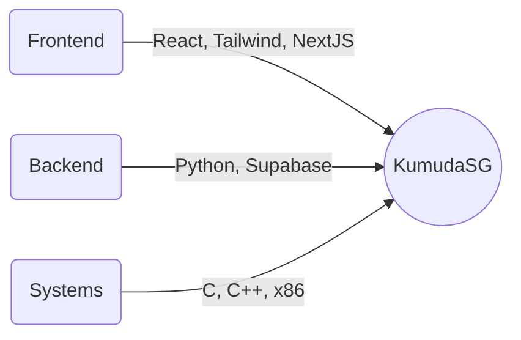

<!-- Futuristic Techy Themed GitHub Profile README for KumudaSG -->

  

  
  

---

<h2 align="center"> Welcome to My Space </h2>

  <b>🚧 Building the future with code, systems, and intelligent agents 🚧</b>

---

### 👾 About Me

- 🧑‍💻 AI Software Engineer @ <b>AgentLab</b>, Gies College of Business
- 🛸 Futurist, system tinkerer, and automation enthusiast
- ⚡ Always exploring the edge of tech

---

### 🛠️ Tech Stack

- **Frontend:** React ⚛️, NextJS, TailwindCSS
- **Backend/Data:** Supabase, Python 🐍
- **Systems:** C, C++, x86 Assembly
- **AI/ML:** Experimenting with agent frameworks

---

### 🧬 Currently Leveling Up

- SystemVerilog (hardware design 🚦)
- n8n (workflow automation ⚙️)
- LangChain, LangGraph (AI/LLM orchestration 🧠)

---

### 🌐 Connect & Collaborate

- 📫 [Email](mailto:your.email@domain.com)
- 💼 [LinkedIn](https://www.linkedin.com/in/your-linkedin/)
- 🛰️ [Personal Website](https://yourwebsite.com) <!-- Add your links! -->

---

  

  

